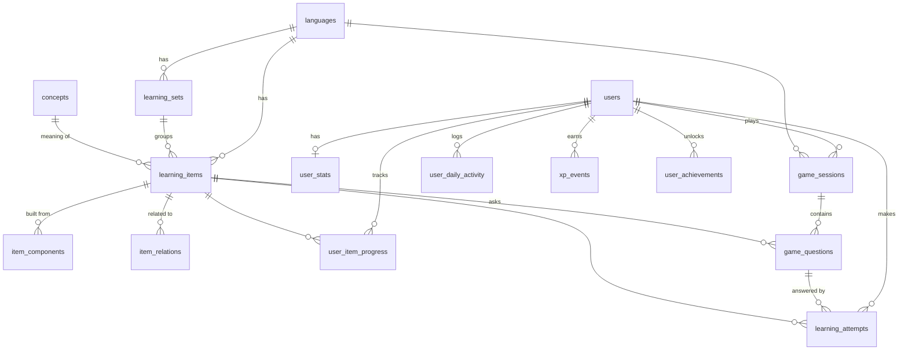

# Polyglot Quest: Phase 1 (phân tích & kế hoạch)

> Kết quả Phase 1 của `LANGUAGE_LEARNING_PLATFORM_SPEC.md`. Tài liệu này **chưa thay đổi code**.
> Các mục đánh dấu ❓ là quyết định cần bạn chốt trước khi sang Phase 2.

---

## 1. Kiến trúc hiện tại

| Hạng mục | Hiện trạng | Ghi chú |
|---|---|---|
| Monorepo | pnpm 9 workspaces: `apps/api`, `apps/web`, `packages/{config,types}` (rỗng) | Node ≥ 22.22 |
| Backend | NestJS 12, ESM (`nodenext`, import đuôi `.js`), global prefix `/api` | |
| Database | PostgreSQL 17 (docker, cổng 5433), Redis (chưa dùng), Mailpit | |
| ORM | Prisma 7 + `@prisma/adapter-pg`, client generate vào `src/generated/prisma` | 3 bảng: `users`, `otp_codes`, `refresh_tokens` |
| Auth | JWT access token (bộ nhớ) + refresh token httpOnly cookie, `JwtAuthGuard`, `@CurrentUser()` → `payload.sub` = userId | |
| Kiến trúc BE | `modules/<feature>/{controller, service, dto, entities, repositories}`; repository = abstract class + `Prisma*Repository`, bind bằng `{ provide, useClass }`; `TransactionHost` (AsyncLocalStorage) để gom nhiều repository vào 1 transaction | Giống Laravel: Module ≈ ServiceProvider, abstract repository ≈ interface bind trong container |
| Validation | `ValidationPipe` global (`whitelist`, `forbidNonWhitelisted`, `transform`) + class-validator DTO | DTO ≈ FormRequest |
| Lỗi | `ApiError(status, code)` với `ErrorCode` cố định; FE dịch `apiErrors.<code>` | |
| Rate limit | `ThrottlerGuard` global 100 req/phút | |
| Test BE | Vitest, `*.spec.ts`, fake repository in-memory (xem `otp.service.spec.ts`) | |
| Lint BE | oxlint type-aware, prettier (single quote, có `;`) | |
| Frontend | React 19, Vite 8, React Router 8 (`createBrowserRouter`), TanStack Query 5, Zustand 5, axios (`lib/http.ts`, tự refresh 401), react-hook-form + zod, Tailwind 4 (token trong `index.css`), lucide-react, sonner | Không dấu `;` |
| UI kit | `components/ui/{Button, TextField, PasswordField, DotsLoader}`, dark mode qua `.dark` | |
| i18n | i18next, `en`/`vi` trong `src/i18n/locales/*.json`, nội dung học dùng kiểu `Localized { vi, en }` | |
| Nội dung học có sẵn | `features/learn/content/{en,de,ja,ko}` (TS tĩnh ~8.000 dòng): bảng kana (GOJUON/DAKUTEN/YOON), jamo + công thức ghép Unicode (`lib/hangul.ts`), `HangulBuilder`, Web Speech (`lib/speech.ts`) | Chỉ để **đọc tham khảo**, chưa có tiến độ |
| Route | `/app` (HomePage), `/app/:lang/{writing,pronunciation,grammar}` | |
| Test FE | **Chưa có** test runner | |
| Timezone | **Chưa có** chính sách nào (không cột, không header) | |

## 2. Tái sử dụng

- **BE**: cấu trúc module/repository/`TransactionHost`, `JwtAuthGuard` + `@CurrentUser`, `ApiError`, `ValidationPipe`, Throttler, Vitest + fake in-memory.
- **FE**: `http` (axios + refresh), TanStack Query cho server state, Zustand cho global state, `Button`, design token, i18n, `sonner`.
- **Nội dung**: bảng kana và công thức ghép Hangul (`composeSyllable`) để **sinh** seed thay vì gõ tay; `HangulBuilder`/`JamoPicker` làm nền cho Character Builder; `lib/speech.ts` thành 1 implementation của `AudioProvider`.
- Các trang tham khảo `writing/pronunciation/grammar` **giữ nguyên**.

## 3. Cần thêm mới

| Thêm | Lý do |
|---|---|
| Các bảng nội dung học + tiến độ trong DB | Server phải biết đáp án để chấm điểm, nên nội dung luyện tập không thể chỉ nằm ở FE |
| 4 module BE: `content`, `progress`, `games`, `gamification` | Tách Learning / Progress+Review / Game / XP-Achievement engine theo spec |
| Cột `users.timezone` (IANA, vd `Asia/Ho_Chi_Minh`) | Streak và daily goal cần biết "hôm nay" của user. Node có sẵn `Intl` nên không cần thêm thư viện |
| `tsx` (devDependency của api) | Chạy seed TypeScript (`prisma db seed`). Node không tự chuyển import `.js` sang `.ts` được |
| ❓ `vitest` + `@testing-library/react` + `jsdom` cho web | Spec §41 yêu cầu test FE; dùng cùng Vitest với BE cho đồng bộ |

Không thêm: event bus, state machine lib (XState), Redux, i18n mới, thư viện SRS. Dùng `useReducer` và service gọi trực tiếp là đủ.

## 4. Bảng đã có

`users`, `otp_codes`, `refresh_tokens`. Chưa có bảng nào liên quan việc học.

## 5. Bảng đề xuất (14 bảng + 1 cột)

### 5.1 Đánh giá danh sách gợi ý trong spec

| Spec gợi ý | Quyết định | Lý do |
|---|---|---|
| `languages` | ✅ giữ | PK là `code` (`'ja'`) nên URL và FK dễ đọc, khỏi join |
| `language_scripts` | ❌ thành cột `script` trên set | Chỉ là nhãn để nhóm, không có thuộc tính riêng |
| `alphabet_sets` + `vocabulary_categories` | 🔀 gộp thành `learning_sets` (`kind` = ALPHABET/VOCABULARY, `category` slug) | Mọi game, tiến độ và achievement chỉ cần **một** đơn vị nhóm: "Hiragana cơ bản", "Từ vựng Đức: Đồ ăn" |
| `alphabet_characters` + vocabulary | 🔀 gộp thành `learning_items` (`type` = CHARACTER/SYLLABLE/WORD) | Game chỉ thấy "item" nên không phải viết engine riêng cho từng loại |
| `learning_item_translations` | 🔀 thành `concepts` (nghĩa chung: apple ↔ Apfel ↔ りんご ↔ 사과) + `gloss` JSONB `{en, vi}` | Đúng §4B: từ vựng xoay quanh nghĩa chứ không quanh một ngôn ngữ. JSONB giống kiểu `Localized` đang dùng ở FE |
| `learning_item_pronunciations` | ❌ thành cột `reading`, `romanization`, `ipa`, `accepted_answers[]` | MVP mỗi item có 1 cách đọc; khi cần kanji nhiều âm On/Kun thì tách bảng sau |
| `alphabet_character_components` | ✅ `item_components` | Spec §13: giữ cấu tạo 곡 = ㄱ + ㅗ + ㄱ, きゃ = き + ゃ |
| (biến thể, chữ liên quan §14, nhầm lẫn §20) | ✅ `item_relations` | あ↔ア, か→が, cặp dễ nhầm do người soạn cấu hình (さ/き) |
| `user_learning_progress` | ✅ `user_item_progress` | |
| `learning_attempts` | ✅ giữ, là **nhật ký gốc** | Nguồn cho mistakes, confusion, thống kê |
| `learning_reviews` | ❌ thành cột `rating` trong attempts | Một lần review flashcard cũng là một attempt |
| `game_sessions`, `game_session_questions` | ✅ `game_sessions`, `game_questions` | Câu hỏi và đáp án đúng do server sinh và giữ |
| `game_session_answers` | ❌ thành `learning_attempts.question_id` | Tránh lưu câu trả lời 2 nơi. Game Matching có thể có nhiều attempt cho 1 câu |
| `user_streaks` | 🔀 gộp vào `user_stats` (total XP + streak) | Đọc 1 dòng là có header dashboard |
| `user_daily_progress` | ✅ `user_daily_activity` theo (user, ngày local, ngôn ngữ) | Phục vụ daily goal kiểu "Luyện tiếng Nhật" |
| `achievements` | ❌ định nghĩa trong code (registry) | Logic đánh giá vốn nằm trong code, tiêu đề/mô tả nằm ở i18n |
| (XP) | ✅ `xp_events` (sổ cái, có unique key) | Chống cộng XP 2 lần, kiểm tra được lịch sử, daily goal hoàn thành cũng là 1 event |
| `user_achievements` | ✅ giữ | |

### 5.2 ERD



### 5.3 Chi tiết cột (rút gọn)

**Learning Engine: nội dung (dùng chung cho mọi user)**

| Bảng | Cột chính | Ràng buộc / index |
|---|---|---|
| `languages` | `code` PK, `native_name`, `speech_lang` (`ja-JP`), `sort_order`, `is_active` | |
| `learning_sets` | `id` uuid, `language_code` FK, `slug`, `kind` enum, `script` (`hiragana`…) nullable, `category` (`food`…) nullable, `title` JSONB `{en,vi}`, `sort_order` | unique(`language_code`,`slug`) |
| `concepts` | `id`, `slug` unique (`apple`), `gloss` JSONB `{en,vi}`, `emoji` nullable | |
| `learning_items` | `id`, `set_id` FK (ngôn ngữ lấy qua set, không lặp cột), `type` enum, `text` (`ぬ`/`가`/`Apfel`/`犬`), `reading` (`いぬ`) nullable, `romanization` (`nu`), `ipa` nullable, `accepted_answers` text[] (cách viết romanization khác: `shi`/`si`), `concept_id` FK nullable, `attributes` JSONB (giống, mạo từ der/die/das…), `audio_url` nullable, `difficulty` smallint, `sort_order` | unique(`set_id`,`text`); idx(`concept_id`) |
| `item_components` | `item_id`, `position`, `role` enum (INITIAL/VOWEL/FINAL/BASE/SMALL/MARK), `text`, `component_item_id` FK nullable | PK(`item_id`,`position`) |
| `item_relations` | `item_id`, `related_item_id`, `kind` enum (SCRIPT_COUNTERPART/VOICED/SEMI_VOICED/CONFUSABLE) | PK(3 cột); idx(`related_item_id`) |

**Progress + Review Engine**

| Bảng | Cột chính | Ràng buộc / index |
|---|---|---|
| `user_item_progress` | `user_id`, `item_id`, `attempt_count`, `correct_count`, `correct_streak`, `mastery_level` (0–5), `interval_minutes`, `last_reviewed_at`, `due_at`, timestamps | PK(`user_id`,`item_id`); idx(`user_id`,`due_at`); idx(`item_id`) |
| `learning_attempts` | `id`, `user_id`, `item_id`, `session_id`, `question_id`, `idempotency_key` uuid, `given_answer`, `is_correct`, `confused_with_item_id` nullable, `rating` enum nullable, `response_ms`, `created_at` | unique(`user_id`,`idempotency_key`); idx(`user_id`,`created_at`); idx(`user_id`,`item_id`); idx(`question_id`) |

Cột trạng thái riêng của thuật toán (ease cho SM-2, stability cho FSRS) chỉ thêm khi đổi scheduler. Không lưu `incorrect_count` và `accuracy` vì đều tính được từ `attempt_count` và `correct_count`. Có lưu `mastery_level` vì đó là **kết quả của scheduler**: khi đổi sang FSRS thì cách tính đổi theo, và dashboard đếm "Mastered" rất nhanh.

**Game Engine**

| Bảng | Cột chính | Ràng buộc / index |
|---|---|---|
| `game_sessions` | `id`, `user_id`, `game_type` enum, `language_code`, `source` enum (SET/DUE/MISTAKES), `set_id` nullable, `status` enum (ACTIVE/COMPLETED/EXPIRED), `time_limit_s` nullable, `started_at`, `expires_at`, `completed_at`, `score`, `correct_count`, `incorrect_count`, `max_combo` | idx(`user_id`,`created_at`); idx(`user_id`,`game_type`,`language_code`,`status`) |
| `game_questions` | `id`, `session_id`, `position`, `item_id`, `kind` enum, `options` JSONB `[{id,text,itemId}]`, `correct_answer` (**không bao giờ gửi cho client**), `answered_at`, `is_correct` | unique(`session_id`,`position`) |

`duration` không lưu, tính bằng `completed_at - started_at`. Các số tổng của session chỉ ghi **một lần** lúc complete làm snapshot, để trang lịch sử khỏi phải cộng lại attempts.

**Gamification**

| Bảng | Cột chính | Ràng buộc / index |
|---|---|---|
| `user_stats` | `user_id` PK, `total_xp`, `current_streak`, `longest_streak`, `last_study_date` (DATE local) | |
| `user_daily_activity` | `user_id`, `activity_date` (DATE local), `language_code`, `xp`, `attempts`, `correct`, `new_items`, `reviews`, `games_completed` | PK(`user_id`,`activity_date`,`language_code`) |
| `xp_events` | `id`, `user_id`, `amount`, `source` enum (ANSWER/SESSION/PERFECT/DAILY_GOAL/ACHIEVEMENT), `source_key`, `created_at` | **unique(`user_id`,`source`,`source_key`)**; idx(`user_id`,`created_at`) |
| `user_achievements` | `user_id`, `achievement_key`, `unlocked_at` | PK(`user_id`,`achievement_key`) |

`users` thêm `timezone text NOT NULL DEFAULT 'UTC'`. FE gửi `Intl.DateTimeFormat().resolvedOptions().timeZone` một lần sau khi đăng nhập.

## 6. API (theo convention hiện tại: `/api`, JWT, DTO class-validator, `ApiError`)

| Method | Path | Mục đích |
|---|---|---|
| GET | `/languages` | Danh sách ngôn ngữ + set + số item (dữ liệu nội dung, cache được) |
| GET | `/languages/:code/sets` | Set của 1 ngôn ngữ + tiến độ của user theo từng set (`seen`/`mastered`/`due`) |
| GET | `/learning-sets/:id/items?page=&pageSize=` | Item của 1 set, có phân trang (tối đa 100/trang) |
| POST | `/game-sessions` | `{ gameType, language, source: {type:'SET', setId} \| {type:'DUE'} \| {type:'MISTAKES'} }` → session + câu hỏi (**không kèm đáp án**) |
| GET | `/game-sessions/:id` | Mở lại session dở (vd sau khi F5) |
| POST | `/game-sessions/:id/answers` | `{ questionId, optionId? \| text? \| rating?, responseMs, idempotencyKey }` → `{ correct, correctAnswer, xpGained, combo }` |
| POST | `/game-sessions/:id/complete` | → tổng kết: score, phần XP, achievement mới mở, goal vừa xong, personal best |
| GET | `/reviews/due?language=` | Số item đến hạn + preview |
| GET | `/dashboard` | **Một** endpoint gom: streak, XP, goal hôm nay, số đến hạn, điểm yếu, thẻ ngôn ngữ |
| GET | `/mistakes?language=&page=` | Item yếu + cặp hay nhầm |
| GET | `/achievements` | Toàn bộ định nghĩa + trạng thái đã mở |
| GET | `/daily-goals` | Goal hôm nay + tiến độ |
| GET | `/stats?days=30` | Hoạt động theo ngày (Phase 7) |
| PATCH | `/auth/me` | Lưu timezone (`{ timezone }`); đặt cạnh `GET /auth/me` để tránh vòng import Users ↔ Auth |

Bảo mật: **client không bao giờ gửi** `userId`, `xp`, `score` hay `correctAnswer`. Mọi truy vấn session đều lọc theo `(id, user_id)`; nếu không phải của mình thì trả **404** (không để lộ việc session tồn tại). Idempotency key: client gửi lại cùng 1 answer thì nhận về kết quả cũ, không chấm 2 lần.

Error code mới: `GAME_SESSION_NOT_FOUND`, `GAME_SESSION_EXPIRED` (⚠️ **không dùng lại** `SESSION_EXPIRED` vì FE đang hiểu mã đó là "hết phiên đăng nhập"), `GAME_SESSION_COMPLETED`, `QUESTION_ALREADY_ANSWERED`, `NOT_ENOUGH_ITEMS`, `LANGUAGE_NOT_FOUND`, `SET_NOT_FOUND`.

## 7. Module backend

```
apps/api/src/modules/
├── content/        Learning Engine: languages, sets, items
│   ├── language-policies/   chuẩn hoá đáp án theo ngôn ngữ (Strategy, có default Latin)
│   ├── item-selector.service.ts      chọn item cho session: SET / DUE / MISTAKES
│   └── distractor.service.ts         đáp án nhiễu: CONFUSABLE → cùng set → cùng type
├── progress/       Progress + Review Engine
│   ├── review-scheduler.ts           interface ReviewScheduler (Strategy)
│   ├── simple-interval.scheduler.ts  Again 10ph · Hard 1d · Good 3d · Easy 7d, tăng dần theo lần trước
│   ├── progress.service.ts           ghi attempt → cập nhật progress
│   └── mistakes.service.ts           item yếu + cặp nhầm (tính từ attempts)
├── games/          Game Engine
│   ├── game-definitions.ts           registry: GameType → số câu, thời gian, kind câu hỏi
│   ├── generators/                   QuestionGenerator theo kind (Strategy)
│   ├── answer-checker.ts
│   └── game-sessions.{controller,service}.ts
└── gamification/
    ├── xp-policy.ts                  bảng điểm XP duy nhất
    ├── streak.ts                     hàm thuần nextStreak(state, today)
    ├── daily-goals.ts                registry goal
    └── achievements/                 registry + evaluator
```

Luồng một câu trả lời, gói trong **1 transaction** (`TransactionHost.run`):

```
POST /answers → GameSessionsService
   → AnswerChecker (LanguagePolicy)          đúng/sai, confused_with
   → ProgressService.record()                attempt + ReviewScheduler → due_at, mastery
   → GamificationService.onAnswer()          xp_events, daily_activity, streak
```

`/complete` → `GamificationService.onSessionCompleted()` → bonus XP, daily goals, `AchievementEvaluator`.

Các nguyên tắc quan trọng:
- **Không có service riêng cho từng ngôn ngữ.** Chỗ nào khác nhau thật sự (chuẩn hoá đáp án) thì dùng `LanguagePolicy`, và Spanish/French tự dùng policy Latin mặc định. Thêm Spanish chỉ cần thêm **seed**.
- **Chuẩn hoá theo loại đáp án, không theo ngôn ngữ của item.** Đáp án romaji (`ka`) thì trim + NFC + chữ thường. Đáp án tiếng Nhật thì NFKC (ｶ → カ), **không** đổi hoa/thường. Tiếng Hàn thì NFC. Tiếng Đức/Anh thì không phân biệt hoa/thường. Các cách viết khác (`shi`/`si`, `tsu`/`tu`) lấy từ `accepted_answers`, **không đoán**.
- **Scheduler**: câu sai luôn về "Again". Câu đúng trong game chỉ đẩy lịch khi item **mới hoặc đã đến hạn**, để chơi game liên tục không làm lệch lịch SRS. Flashcard dùng đúng rating người dùng chọn.
- **Thêm game mới** = 1 entry trong `game-definitions` + 1 generator (nếu cần kind câu hỏi mới) + 1 component FE. Progress, XP và achievement dùng lại nguyên.

## 8. Frontend

### 8.1 Route mới

| Route | Trang |
|---|---|
| `/app` | Dashboard: nâng cấp `HomePage` (streak, XP, goal, đến hạn, điểm yếu, thẻ ngôn ngữ có tiến độ) |
| `/app/:lang/practice` | Tab mới "Luyện tập" trong `LanguageLayout`: chọn set và game |
| `/app/play/:sessionId` | Màn chơi chung cho mọi game (chế độ tập trung) |
| `/app/review` | Đến hạn hôm nay + Mistakes |
| `/app/progress` | XP, streak, achievements, thống kê |

`play`, `review`, `progress` là segment tĩnh nên React Router ưu tiên chúng hơn `:lang`. Ba chữ này coi như từ khoá dành riêng, không dùng làm mã ngôn ngữ.

### 8.2 Cấu trúc `features/practice/`

```
features/practice/
├── api.ts, queries.ts, types.ts     gọi API, TanStack Query, kiểu discriminated union cho Question
├── engine/
│   ├── game-reducer.ts              state machine thuần: idle → loading → playing → answering → answered → completed | error
│   └── useGameSession.ts            reducer + mutation + retry + nhớ sessionId (sessionStorage) để F5 vẫn chơi tiếp
├── audio/                           AudioProvider (interface) ← SpeechSynthesisProvider (bọc lib/speech.ts), FileAudioProvider (audio_url)
├── games/                           FlashcardGame, MultipleChoiceGame, MatchingGame, TypingGame, SpeedGame, ListeningGame, BuilderGame
│   └── registry.ts                  GameType → component
├── components/                      GameShell, ProgressBar, AnswerOption, OptionGrid (phím 1–4), Flashcard, RatingButtons,
│                                    TypingInput, MatchingBoard (click/tap, không bắt kéo thả), GameTimer, GameResult,
│                                    XPBadge, StreakBadge, DailyGoalCard, AchievementCard, CharacterBuilder (tách từ HangulBuilder)
└── pages/                           PracticeHubPage, PlayPage, ReviewPage, ProgressPage
```

Game state dùng `useReducer` với discriminated union: state local của màn chơi thì không cần Zustand, còn server state đã có TanStack Query lo. Server lưu toàn bộ câu hỏi và câu đã trả lời, nên mất mạng hay F5 đều chơi tiếp được (`GET /game-sessions/:id`). Request lỗi được retry với **cùng idempotency key**.

### 8.3 Mobile & a11y (áp dụng cho mọi bước UI)

- Nút đáp án ≥ 44px, lưới 2×2 trên điện thoại. Input ≥ 16px (tránh iOS zoom), `lang="ja"`/`lang="ko"` cho ô gõ.
- Phím tắt: `1–4` chọn đáp án, `Space` lật thẻ, `Enter` sang câu tiếp.
- Đúng/sai báo bằng **màu + icon + `aria-live`** chứ không chỉ màu. Tôn trọng `prefers-reduced-motion`.

## 9. Rủi ro & xung đột

1. **Nội dung bị lặp FE ↔ BE.** Bảng kana đang nằm trong `features/learn/content/ja`, và seed BE sẽ có một bản nữa. *Đề xuất:* BE là nguồn chuẩn cho dữ liệu **luyện tập**, trang tham khảo FE giữ nguyên. Sau này có thể chuyển sang `packages/` dùng chung, nhưng làm vậy cần build step cho package nên để sau.
2. **Server chấm từng câu ⇒ mỗi câu 1 round-trip.** Chạy local khoảng 20–50ms, chấp nhận được. Đây là cái giá để client không biết trước đáp án.
3. **Listening dùng TTS trên trình duyệt** nên client buộc phải biết chữ cần đọc, tức là đáp án lộ qua DevTools. Chấp nhận ở MVP; khi có `audio_url` thật thì hết lộ.
4. **Tiếng Anh với UI tiếng Anh**: "apple" nghĩa là "apple", câu hỏi nghĩa trở nên vô nghĩa. *Đề xuất:* trường hợp này generator chuyển sang dạng chỉ dùng chữ đích (nghe chọn từ, nghe gõ chính tả).
5. **Timezone chưa có chính sách** nên cần cột mới, dữ liệu streak tính theo ngày local của user.
6. **Đúng chuẩn ngôn ngữ của seed**: chỉ dùng từ cơ bản, phổ biến. Chỗ nào chưa chắc (romanization biến thể, số nhiều tiếng Đức) sẽ ghi `// VERIFY` và liệt kê lại cho bạn.
7. **Throttler 100/phút**: Speed Challenge trả lời nhanh cộng các request khác có thể chạm ngưỡng, nên nâng riêng cho `games` controller.
8. **`か + ん → かん`** là 2 âm tiết chứ không phải 1 ký tự ghép. MVP chỉ làm yōon (きゃ) và dakuten. "Ghép chuỗi" để sau.
9. **Phạm vi lớn**: ước tính khoảng 70–90 file mới qua 6 phase. Mỗi phase nên là 1 branch/PR riêng để dễ review.

## 10. Thứ tự triển khai

| Phase | Nội dung | Kiểm chứng |
|---|---|---|
| **2. Nội dung** | Schema: languages, sets, items, components, relations, concepts, `users.timezone`. Seed (tsx, idempotent): Hiragana/Katakana sinh từ **1 bảng** (46 + 25 + 33 mỗi bộ), Hangul 14 phụ âm + 5 âm đôi + 10 nguyên âm + 11 nguyên âm ghép, 140 âm tiết CV sinh bằng thuật toán, ~60 concept × 4 ngôn ngữ / 13 chủ đề. API `GET /languages`, `/languages/:code/sets`. | `prisma migrate dev`, `db seed` chạy 2 lần không lỗi, test `LanguagePolicy`, đếm số item |
| **3. Game core** | progress + attempts + sessions + questions. `ReviewScheduler`, `ItemSelector`, `DistractorService`. Generator Flashcard + MC. FE: reducer, PlayPage, Flashcard, MultipleChoice, tab Practice | Unit test scheduler/checker/ownership; chơi thử trên trình duyệt |
| **4. Thêm game** | Matching (tap từng cặp, combo), Typing, tính score/combo, GameResult | Test scoring; chơi thử trên mobile 375px |
| **5. Gamification** | xp_events, user_stats/streak, daily_activity, daily goals, achievements, Mistakes + confusion, trang Review | Test streak (đổi múi giờ), XP không cộng trùng, achievement |
| **6. Game nâng cao** | Character Builder (Hangul CV/CVC, yōon), Listening (`AudioProvider`), Speed Challenge + personal best | Test builder; chơi thử |
| **7. Hoàn thiện** | Dashboard, trang Progress/stats, animation (reduced-motion), a11y, xử lý lỗi, test FE | `pnpm lint`, `pnpm build`, test toàn bộ |

Mỗi phase: tạo branch (`/branch`) → làm → `pnpm --filter api test && pnpm lint && pnpm build` → tóm tắt file đã đổi + TODO → `/commit`.

## 11. Quyết định cần chốt ❓

1. **Cách làm việc**: Claude code từng phase rồi giải thích, hay hướng dẫn từng bước để bạn tự gõ, hay kết hợp?
2. **Timezone**: lưu theo từng user (tự lấy từ trình duyệt, đề xuất), hay cố định 1 múi giờ cho cả app?
3. **Test FE**: thêm Vitest + Testing Library cho `apps/web` (đề xuất, spec §41 yêu cầu), hay tạm chỉ test BE?

## 12. Nhật ký triển khai

| Phase | Branch | Trạng thái |
|---|---|---|
| 1 | — | ✅ Phân tích (tài liệu này) |
| 2 | `feat/learning-content-model` | ✅ Schema + migration `add_learning_content`, seed (4 ngôn ngữ, 79 concept, 64 set, 729 item, 609 component, 340 relation), `GET /languages`, `GET /languages/:code/sets`, `GET /learning-sets/:id/items`, `PATCH /auth/me`, `LanguagePolicy`, web tự đồng bộ timezone |
