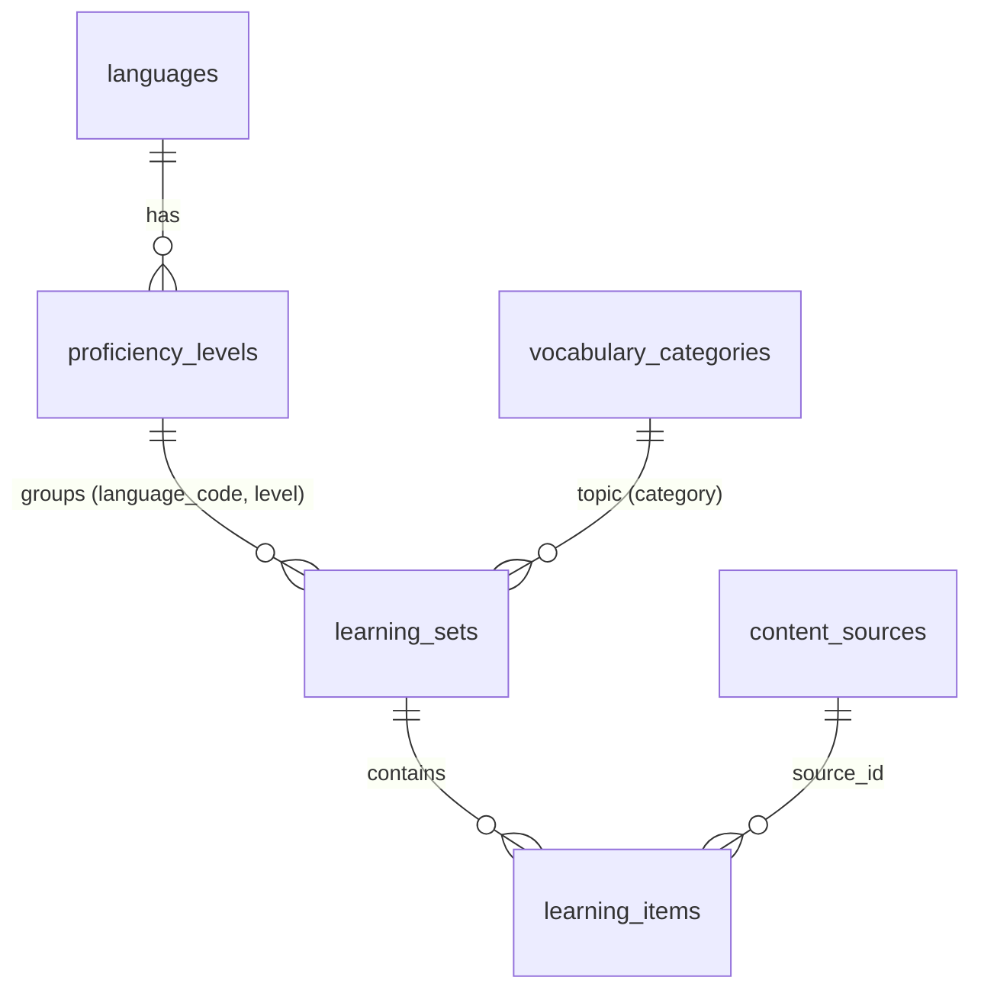

# Dữ liệu từ vựng theo cấp độ & API dịch

> Nhánh `feat/vocabulary-data-translation`. Tài liệu này mô tả nguồn dữ liệu, cách tổ chức bảng, cách sửa dữ liệu và cách cấu hình dịch máy.

## 1. Tổng quan

| Ngôn ngữ | Cấp độ | Số từ | Số bộ (≤ 30 từ/bộ) | Nguồn danh sách từ | Nghĩa tiếng Việt |
|---|---|---|---|---|---|
| Tiếng Anh | B1 | 2.403 | 96 | CEFR-J Wordlist 1.5 | UnYoWo biên soạn |
| Tiếng Anh | B2 | 2.732 | 106 | CEFR-J Wordlist 1.5 | UnYoWo biên soạn |
| Tiếng Đức | A1 | 746 | 39 | Goethe A1 (chỉ lấy từ đầu mục) + nhóm từ A1 (số, thứ, tháng, màu…) | UnYoWo biên soạn (kèm mạo từ, số nhiều, nghĩa tiếng Anh) |
| Tiếng Đức | A2 | 581 | 36 | Goethe A2 (bỏ từ đã có ở A1) | UnYoWo biên soạn |
| Tiếng Nhật | N5 | 946 | 46 | JLPT N5 (Jonathan Waller) + file Minna của bạn | File N5.csv của bạn (đã sửa) + UnYoWo |
| Tiếng Nhật | N4 | 667 | 36 | JLPT N4 (Jonathan Waller) | UnYoWo biên soạn (kèm Hán Việt) |
| Tiếng Hàn | TOPIK I | 2.390 | 92 | 한국어기초사전 – từ cấp 초급 | 한국어기초사전 (đã soát, sửa ~150 mục) |

Tổng: **10.465 từ, 451 bộ**, chia vào **29 chủ đề** dùng chung cho mọi ngôn ngữ (13 chủ đề cũ giữ nguyên slug). Các bộ "Khởi động" cũ (79 khái niệm × 4 ngôn ngữ) vẫn giữ nguyên.

## 2. Nguồn & giấy phép

| Nguồn | Giấy phép | Ghi chú |
|---|---|---|
| [CEFR-J Wordlist 1.5](https://github.com/openlanguageprofiles/olp-en-cefrj) | Miễn phí cho nghiên cứu và thương mại, **phải trích dẫn** | Chỉ dùng từ + từ loại + cấp độ |
| [JLPT lists – Jonathan Waller](https://www.tanos.co.uk/jlpt/) qua [open-anki-jlpt-decks](https://github.com/jamsinclair/open-anki-jlpt-decks) | CC BY (dữ liệu), MIT (repo) | Có nghĩa tiếng Anh |
| [한국어기초사전](https://krdict.korean.go.kr) qua [korean-dict-nikl](https://github.com/spellcheck-ko/korean-dict-nikl) | **CC BY-SA 2.0 KR** | Có cấp độ, chủ đề, Hán tự, nghĩa Việt/Anh, phát âm |
| Goethe-Zertifikat A1/A2 Wortliste | Tải miễn phí từ goethe.de, **không phải giấy phép mở** | Chỉ dùng danh sách từ đầu mục (dữ kiện), **không** chép câu ví dụ. Nghĩa, số nhiều, chủ đề do UnYoWo viết |
| File `N5.csv` (Minna no Nihongo I) | Do bạn cung cấp | Dùng nghĩa tiếng Việt + Hán Việt |

Ứng dụng hiển thị phần ghi công ở cuối trang Luyện tập (`GET /api/languages/:code/sources`) — CC BY và CC BY-SA yêu cầu điều này.

⚠️ CC BY-SA (tiếng Hàn) là "share-alike": nếu phát hành lại **dữ liệu** tiếng Hàn thì phải giữ cùng giấy phép. Không ảnh hưởng tới mã nguồn của app.

## 3. Thiết kế dữ liệu

| Bảng / cột mới | Ý nghĩa |
|---|---|
| `proficiency_levels` (PK `language_code` + `code`) | Bậc thi: N5, B1, TOPIK1… + `framework` (JLPT/CEFR/TOPIK), `title {en,vi}`, `sort_order` |
| `vocabulary_categories` (PK `slug`) | 29 chủ đề dùng chung, `title {en,vi}`, `emoji` |
| `content_sources` (PK `id`) | Nguồn dữ liệu + giấy phép + dòng ghi công |
| `learning_sets.level`, `learning_sets.part` | Bộ thuộc cấp độ nào, phần thứ mấy của chủ đề. FK kép `(language_code, level)` |
| `learning_sets.category` | Nay là FK tới `vocabulary_categories` |
| `learning_items.meaning` (JSONB `{en?, vi?}`) | Nghĩa riêng của từ. Thiếu key nào thì lấy `concepts.gloss` |
| `learning_items.part_of_speech` (enum) | Từ loại: dùng để chọn đáp án nhiễu cùng từ loại |
| `learning_items.source_id` | Từ này lấy từ nguồn nào |
| `learning_items.attributes` | Đức `{article, gender, plural}`, Nhật `{hanViet, masu}`, Hàn `{hanja}` |
| `translation_cache` | Bộ nhớ đệm dịch máy, unique `(source_lang, target_lang, source_text)` |

Vì sao không tạo bảng `vocabulary_words` riêng? Game, tiến độ, ôn tập… đều làm việc với `learning_items`. Giữ chung một bảng thì mọi game chạy ngay với 10.000 từ mới mà không phải sửa engine.

## 4. Sửa dữ liệu (CSV là nguồn chuẩn)

Dữ liệu nằm ở `apps/api/prisma/seed/vocabulary/<ngôn ngữ>/<cấp độ>.csv` — mở bằng Excel/Google Sheets (UTF-8).

| Cột | Bắt buộc | Ghi chú |
|---|---|---|
| `text` | ✅ | Từ cần học. Danh từ Đức **không** kèm mạo từ |
| `reading`, `romanization`, `accepted` | | Tiếng Nhật: kana, Hepburn có trường âm (ō), cách gõ không dấu (`accepted`, nhiều cách ngăn bằng `\|`). Tiếng Hàn: Revised Romanization |
| `pos` | ✅ | `noun, verb, adjective, adverb, pronoun, determiner, numeral, counter, preposition, conjunction, particle, interjection, phrase, affix` |
| `category` | ✅ | Một trong 29 slug ở `prisma/seed/data/vocabulary-meta.ts` |
| `meaning_vi` | ✅ | |
| `meaning_en` | | Từ tiếng Anh để trống (xem mục 7) |
| cột khác (`article`, `plural`, `han_viet`, `masu`, `hanja`) | | Tự thành `attributes` (`han_viet` → `hanViet`) |
| `source`, `note` | | `source` là id trong `content_sources`; `note` chỉ để người soát đọc |

Sau khi sửa: `pnpm --filter api test` (test kiểm tra từ loại, chủ đề, trùng lặp, cách đọc kanji…) rồi `pnpm db:seed`.

Seed **idempotent** và giữ tiến độ học: một từ được nhận diện theo (chữ, cách đọc, từ loại, chủ đề) trong cùng ngôn ngữ + cấp độ, nên khi chủ đề được chia lại phần thì từ chỉ "chuyển bộ", không mất id. Từ bị xoá khỏi CSV sẽ bị xoá khỏi DB **trừ khi** đã có người học (giữ lịch sử). Mỗi chủ đề được chia đều thành các phần ≤ 30 từ (`MAX_PART_SIZE`).

## 5. Những chỉnh sửa trên file N5.csv của bạn

- Động từ được đưa về **thể từ điển** (起きます → 起きる) cho thống nhất với JLPT; thể ます giữ trong cột `masu`.
- Sửa lỗi copy từ PDF: khoảng trắng/xuống dòng giữa chữ (`どうぞよろし くお願いしま す`), dòng lỗi `ことし|バス`.
- Sửa Hán Việt sai: 左 **Tả** / 右 **Hữu** (bị đảo), 洗う **Tẩy** (ghi "Tiền"), 売る **Mại**, 晩 **Vãn**, 貸す **Thải**, 冷たい **Lãnh**, 荷物 **Hà Vật**, 作る **Tác**, 確認 **Xác Nhận**…
- Sửa nghĩa sai: パンチ = "cái đục lỗ" (ghi "ghế ngồi"), スパイス = "gia vị" (ghi "góc gia vị").
- Bỏ: mẫu khung (`こちらは～さんです`), tên hư cấu (さくら大学, しんおおさか), dòng trùng, ngày viết bằng số (1日…).
- 228 từ có trong file nhưng không thuộc danh sách JLPT (mẫu câu chào hỏi, tên nước, đồ dùng…) được giữ ở N5 với nguồn `minna`.

## 6. API dịch

`POST /api/translate` `{ text (≤ 500 ký tự), source: 'auto'|'vi'|'en'|'de'|'ja'|'ko', target }` → bản dịch + các từ khớp trong kho từ vựng (tra xuôi theo chữ/cách đọc, tra ngược theo nghĩa Việt/Anh). Giới hạn 20 lần/phút. Kết quả được cache trong `translation_cache`.

| Nhà cung cấp | Chi phí | Cấu hình | Ghi chú |
|---|---|---|---|
| **MyMemory** (mặc định) | Miễn phí, không cần key | `MYMEMORY_EMAIL` (tuỳ chọn) | 5.000 ký tự/ngày/IP, 50.000 nếu có e-mail. Chất lượng khá |
| **LibreTranslate** | Miễn phí, tự host | `pnpm translate:up`, `LIBRETRANSLATE_URL=http://localhost:5000` | Không giới hạn. Lần đầu tải model (~1 GB). Nhật/Hàn ↔ Việt dịch qua tiếng Anh nên chất lượng thấp hơn. ⚠️ Chưa chạy thử trên máy này |
| **DeepL API Free** | Miễn phí 500.000 ký tự/tháng | `DEEPL_API_KEY` | Chất lượng tốt nhất, đã hỗ trợ tiếng Việt; đăng ký cần thẻ tín dụng |

Thứ tự thử mặc định: DeepL → LibreTranslate → MyMemory (chỉ những cái đã cấu hình); đổi bằng `TRANSLATION_PROVIDERS`. Một nhà cung cấp lỗi/hết quota thì tự chuyển sang cái kế tiếp; tất cả lỗi mà kho từ vựng vẫn có kết quả thì vẫn trả về phần từ điển.

## 7. Giới hạn đã biết

- **Từ tiếng Anh chưa có định nghĩa tiếng Anh** (`meaning_en` trống). Với giao diện tiếng Anh, bộ B1/B2 chỉ chơi được Thẻ ghi nhớ và Nghe; các game hỏi nghĩa sẽ báo "chưa đủ mục". Hướng xử lý: lấy định nghĩa từ Open English WordNet (CC BY 4.0).
- Một số từ có ở cả bộ Khởi động và bộ theo cấp độ (vd. 고양이) → là hai mục học riêng.
- Nghĩa tiếng Việt do UnYoWo biên soạn cho ~7.000 từ (EN/DE/N4): đã soát nhưng nên được người bản ngữ xem lại dần; sửa trực tiếp trong CSV.
- Hán Việt cho tiếng Hàn chưa có (chỉ có Hán tự `hanja`).
